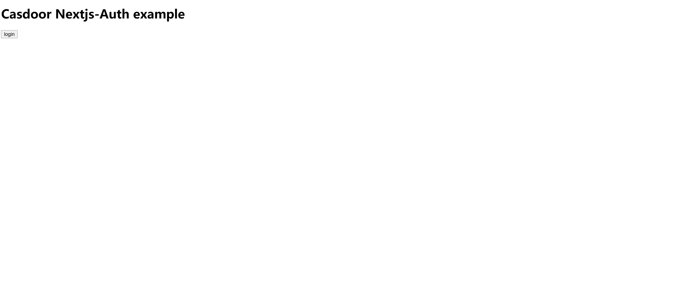

nextjs-auth
=======

A Next.js example for Casdoor SSO.

Live demo: https://nextjs-auth.casdoor.org

## Demo video



## Configuration

`APP_REDIRECT_URL` is your web application's URL, other settings are Casdoor related.

```ini
APP_REDIRECT_URL=http://localhost:3000/login
SERVER_URL=https://door.casdoor.com
CLIENT_ID=294b09fbc17f95daf2fe
CLIENT_SECRET=dd8982f7046ccba1bbd7851d5c1ece4e52bf039d
ORGANIZATION_NAME=casbin
APPLICATION_NAME=app-vue-python-example
```

## Getting started

run the development server:

```bash
yarn dev
```

Open [http://localhost:3000](http://localhost:3000) with your browser to see the result.
